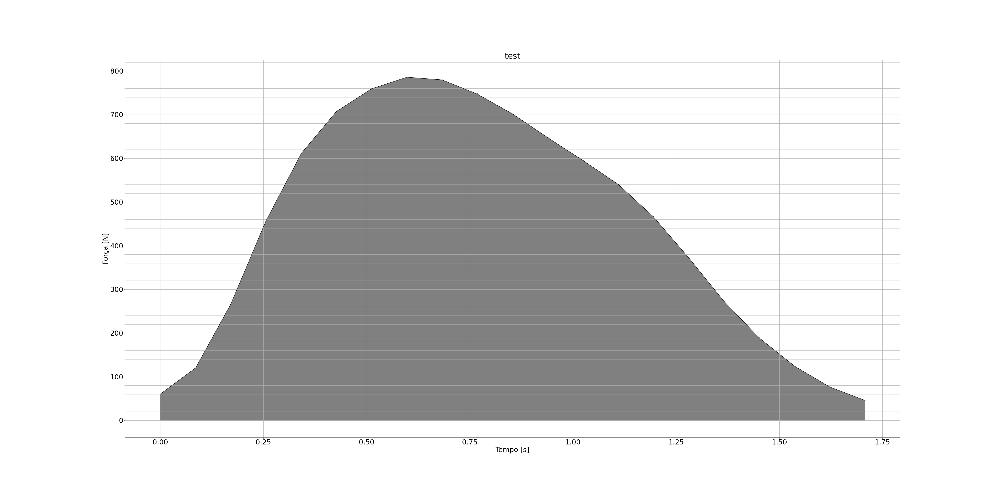
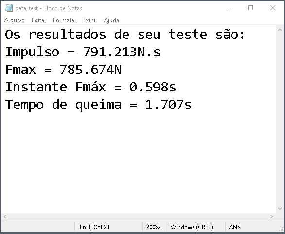

# Executable data analyser static test project
This program is able to read data .csv from the datafile capted by the test and make graph automatically, saving the graph photo with its informations like force, thrust, maximum force, etc

## All data is capted by a instrumentation system

The instrumentation system is composed by:

1. Arduino UNO 
2. HX711
3. Load Cell 

Also, in the `.ino` file can be seen that the code can capture more data in addition to the force data, however, the system is not complete to do so. It requires sensor implementation. Nevertheless, the code is ready to be tested when the hardware be implemented.

[Tutorial video [PT-BR]](https://www.youtube.com/watch?v=GXkCo5zUSEQ&t=8s&ab_channel=RenanLarrieu)

According to the tutorial, the process generates:

1. Graph `.png` file

2. Data `.txt` [file](data_test.txt)

## HX711 use specifications

In the case of `dados_teste_1.csv` all the data was capted by 10 Hz of frequency.
